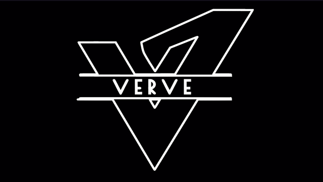

# [College Fest Landing Page](https://akashpawara.github.io/college-fest-landing-page/) 

  [](https://discordapp.com/users/228556195689005059) [](https://www.linkedin.com/in/akashpawara)
 <!-- [](https://github.com/creativetimofficial/black-dashboard/issues/issues?q=is%3Aopen+is%3Aissue) [](https://github.com/creativetimofficial/black-dashboard/issues/issues?q=is%3Aissue+is%3Aclosed) [](https://gitter.im/creative-tim-general/Lobby)  -->
 


 

This is a Landing Page for "Verve" fest organized by Vidyalankar Institute of Technology. It's a Pure html5, css and basic javascript webpage. I have used animate.css to animate some components. Validation of components is done using Jquery. I have used SVG animations for interactive intro.

You can [check out](https://github.com/akashpawara/countdown) this repositry for interactive countdown used in this webpage. 



This Logo was build using Illustrator and animated using cubic bezier animation.

## Table of Contents


* [Quick Start](#quick-start)
* [File Structure](#file-structure)
* [Reporting Issues](#reporting-issues)
* [Technical Support or Questions](#technical-support-or-questions)
* [Social Media](#social-media)

## Quick start

- Clone the repo: `git clone https://github.com/akashpawara/college-fest-landing-page.git`.


<!-- ## Documentation -->


## File Structure
Within the download you'll find the following directories and files:

```
college-fest-landing-page/
├── README.md
├── assets
│   ├── css
│   │   ├── home.css
│   │   └── gal.css
│   ├── js
│   │   ├── jquery.js
│   │   └── count.js
│   └── images
│       ├── art.jpg
│       ├── justjam.jpg
│       ├── justjam1.jpg
│       ├── justjam2.jpg
│       ├── justjam3.jpg
│       ├── justjam4.jpg
│       ├── justjam5.jpg
│       ├── justjam6.jpg
│       ├── spons1.png
│       ├── spons2.png
│       ├── spons3.png
│       ├── spons4.png
│       ├── sportsfp.jpg
│       ├── sportsfp1.jpg
│       ├── sportsfp2.jpg
│       ├── sportsfp3.jpg
│       ├── sportsfp4.jpg
│       ├── sportsfp5.jpg
│       ├── sportsfp6.jpg
│       ├── techfp.png
│       ├── techfp1.jpg
│       ├── techfp2.jpg
│       ├── techfp3.jpg
│       ├── techfp4.jpg
│       ├── techfp5.jpg
│       ├── techfp6.jpg
│       ├── techfp7.jpg
│       ├── techfp8.jpg
│       ├── testcult.jpg
│       ├── testlit2.jpg
│       ├── testsports.jpg
│       ├── testTech.png
│       ├── test.png
│       ├── testpanel.png
│       ├── vervelogo.png
│       ├── trimmedVerve.gif
│       ├── trimmedVerveMob.gif
│       └── trimmedVerveLogo.gif
├── inde.html
├── justjamgal.html
├── sportsgal.html
└── techgal.html
 


```


## Technical Support or Questions

If you have questions or need help integrating the product please [contact us](https://api.whatsapp.com/send?phone=917506021898) instead of opening an issue.


## Social Media

Linkedin: <https://www.linkedin.com/in/akashpawara>

Dev: <https://dev.to/akashpawara>

Behance: <https://www.behance.net/akashpawara>

Instagram: <https://instagram.com/akash_pawara_>

Whatsapp: <https://api.whatsapp.com/send?phone=917506021898>


